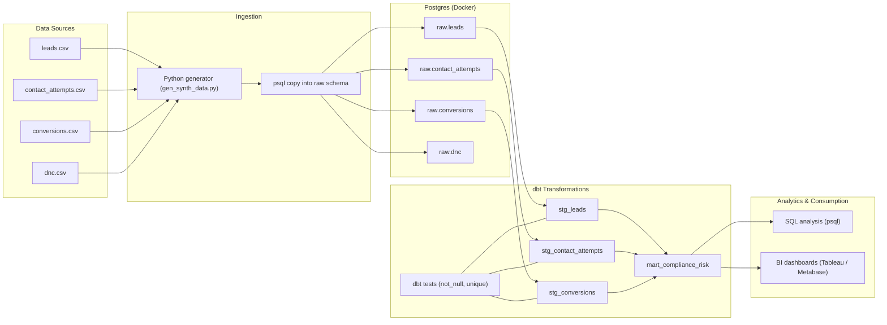

# Compliance-Aware Data Platform (dbt + Postgres)

## Problem
High-volume, multi-channel customer engagement platforms generate millions of regulated interactions (calls, texts, emails).
Without strong data governance, organizations face:
- TCPA / DNC violations
- Inability to quantify compliance risk
- Slow decision-making due to fragmented analytics
- High operational cost from manual audits

## Solution
Designed and implemented an end-to-end, compliance-aware analytics platform using:
- **Postgres** for raw event storage
- **dbt** for governed transformations and testing
- **Docker** for reproducible local infrastructure

The system converts raw engagement data into **auditable, executive-ready risk metrics**.

## Architecture
- Raw Layer: Ads, contact attempts, conversions, DNC lists
- Staging Layer (dbt): Cleaned, typed, tested datasets
- Mart Layer (dbt): `mart_compliance_risk` — a unified compliance risk table

## Key Capabilities
- Timezone-aware calling window enforcement (8am–9pm local)
- Daily attempt frequency violation detection
- Opt-out enforcement monitoring
- DNC list matching via hashed identifiers
- Severity-based risk classification (medium / high / critical)

## Business Impact
- Reduced manual compliance audits
- Enabled proactive risk mitigation
- Created a single source of truth for compliance leadership
- Foundation for ML-driven risk prediction and alerting

## Tech Stack
- Postgres (Dockerized)
- dbt Core + dbt-postgres
- SQL
- Git

## What This Demonstrates
- End-to-end data platform ownership
- Governance-first analytics design
- Regulatory-aware data modeling
- Production-grade transformation discipline
- Executive-level problem framing

## Results (Synthetic Run)

Violation distribution from `analytics.mart_compliance_risk`:

- outside_allowed_hours (high): 250  
- dnc_match (critical): 36  
- attempt_after_opt_out (high): 30  
- no_consent (high): 20  
- too_many_attempts_per_day (medium): 2  

Reproduce:

```bash
docker exec -it cci_postgres psql -U cci_user -d cci_db -c "
select violation_type, severity, count(*) as cnt
from analytics.mart_compliance_risk
group by 1,2
order by cnt desc;"
```

## Executive Takeaways

- Majority of compliance risk originated from operational misconfiguration
  (calling outside allowed hours), indicating system-level rather than agent-level failure.
- DNC and post–opt-out violations represent critical legal exposure and require
  real-time suppression controls.
- Consent gaps remain a material risk even with moderate volumes, reinforcing the
  need for consent-aware routing and campaign gating.
- Low incidence of attempt-frequency violations suggests rate-limiting controls
  are largely effective.



